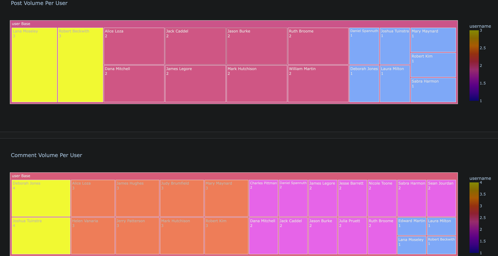

Flask Forum Project:
 - This project is to demonstrate a forum type service like reddit in which 
people are able to create posts and comments while being able to upvote
and down vote accordingly.

Tech Summary:
 - The core of this project uses Flask as the web application framework
while SQLAlchemy is used as the abstraction layer in communications between
Flask and the Database.
 - Additional capabilities have been granted to Flask through the use of
extensions such as:
   - Password hashing functionality through Flask-Bcrypt.
   - User session management (logging in and out etc.) through Flask-Login.
   - Form management and validation through WTForms.
 - Dashboard Visualizations have also been made available through the use of
DASH as the visualization framework.  These visualizations provide insights
into the activity and patterns of the user base such as userbase growth,
post/comment volume, most active users/posts etc.
 - The languages used to create this project are python, HTML, and CSS.
 
App Behavior & Functionality:
  - Certain activities require account creation such as to create posts,
comments, and upvote/down vote.  Additionally, posts and comments can only
be edited or deleted by the originator.
  - Views for each individual post are tracked and incremented for any user
regardless of whether they actually have an account.
  - Avatars are automatically generated for each user through the use of
avinit, albeit with some modifications (https://github.com/CraveFood/avinit).
These avatars are generated as an svg using the initials of the associated
username.  A random color is also assigned to this avatar.
  - Post and comment history can be viewed by any user (registered or not).
  - A sidebar is shown on each page with stats like post count / comment count.
These stats are displayed in reference to both the individual user level and
the overall system level.

Administration:
 - At the moment there is no functionality in place to establish admin rights for
a particular user however this will be added shortly.
 - With SQLAlchemy this app is able to easily clear and recreate the necessary
database tables in order to work.  At the moment these functions are available
in the navbar for demonstration purposes (i.e. without any user level access
restrictions):
   - "Reset-DB" will drop all existing tables that are associated with the app 
 and will recreate them in order to start with a blank slate (i.e. no posts or
 comments.)  From this point forward new users can register and post etc.
   - "Auto-Populate-DB" does the same as "Reset-DB" except it also triggers a
 script to generate random users, posts, comments, views, upvotes, and downvotes 
 with some form inputs to set limits on how much content to create
 for each respective category:
     - Some date in the past is defined as the starting point for the "birth" of
 the system in order to serve as the timeline for which all other user activity is
 generated and dependent on (i.e. from that "starting point" to "now").
     - Users are auto generated with random first and last names.  Their
 associated emails are generated with the pattern 'firstname.lastname@gmail.com'
 and their associated password is 'pswd'.
     - Posts are generated by assigning a random user, post date, title, topic,
 and content.  The titles and topic for each of these posts is generated by fetching
 through get_topic.  The content of each post is auto generated by fetching a random
 quote with a random seed word sourced from the auto generated title.  The intent
 here is to generate random content that at least may have a sliver of relevance
 between the title, topic word, and post content.  This is performed more for
 aesthic reasons rather than aiming for really realistic and coherent speech.
 In any case I would say that this is much more pleasing to the eye than endless
 fields of lorem ipsum...
     - Comments are generated in a similar fashion to the posts while upvotes and
 downvotes are distributed randomly according to limits set when initializing the
 Auto-Populate-DB function.
 - To get things started the app will look for the following env parameters in 
flask_forum/flaskforum/.env:
   - SECRET_KEY =
   - SQLALCHEMY_DATABASE_URI =
   - FLASK_ENV=
 - SQLALCHEMY will know where to generate the DB tables once the Database URI is
set.  Due to the versatility of SQLALCHEMY many database variants can be used with
this app without having to worry about any syntax specific changes for SQL statements
etc.  SQLAlchemy supports SQLite, Postgresql, MySQL, Oracle, MS-SQL, Firebird, Sybase
and others.

Home Page:

Post Detail:

User History:

Auto Populate:

Dashboard 1:

Dashboard 2:

Dashboard 3:

Dashboard 4:

References:
 - The core reference used to start this project is Corey Schafer's excellent Flask
Series on youtube.  I highly recommend watching his videos in order to get familiar
with Flask and start a similar project:
   - https://youtube.com/playlist?list=PL-osiE80TeTs4UjLw5MM6OjgkjFeUxCYH
   - https://github.com/CoreyMSchafer/code_snippets/tree/master/Python/Flask_Blog
 - The youtube series on Flask by Tim Ruscica is also highly recommended:
   - https://youtube.com/playlist?list=PLzMcBGfZo4-n4vJJybUVV3Un_NFS5EOgX
   - https://github.com/techwithtim/Flask-Blog-Tutorial
 - For a good written tutorial on Flask I would look at this series from
hackers and slackers:
   - https://hackersandslackers.com/series/build-flask-apps/
   - https://github.com/hackersandslackers/flask-jinja-tutorial